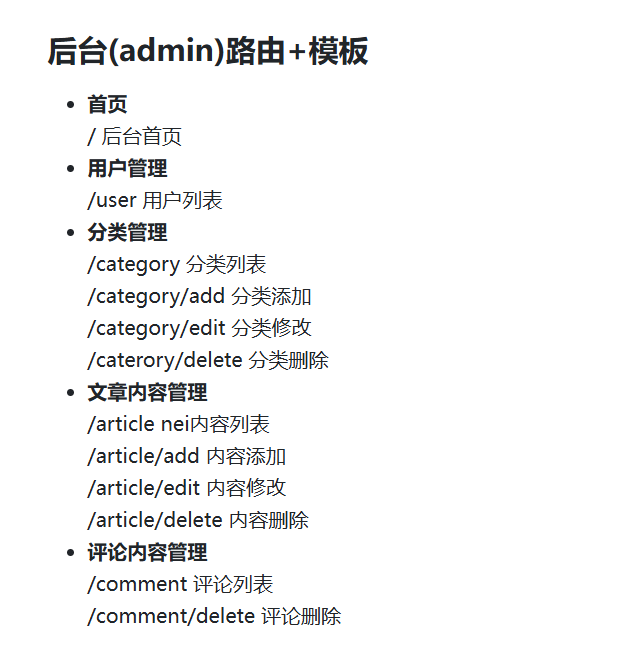

 后台位置:    D:\2024JAVAWEB\backendtest

# 技术栈:

前台前端: html css js layui

前台后端: springboot + security + jwt + mybatis + mysql 

后台前端: layuiadmin模板

后台后端: 同上

-------

功能设计:

归档就是时间线，可以根据文章的上传时间来进行渲染

表设计:

+ 用户表(users)，只有我自己一个，没有设定那些管理员之类的

u_id(0) 昵称，用户名，密码 角色(为了后期扩展，可以加上去)

+ 评论表(comments)(要登录才能进行)

comment_id, content内容，评论人u_id, article_id

+ 标签表(tags):
tags_id, 标签名称

+ 文章表(circles)
circles_id，标题，发布时间，更新时间，作者id，标签

+ 分类表(categories)
categories_id, name,

+ 文章分类表(categories)
article_categories_id，文章id，分类id

